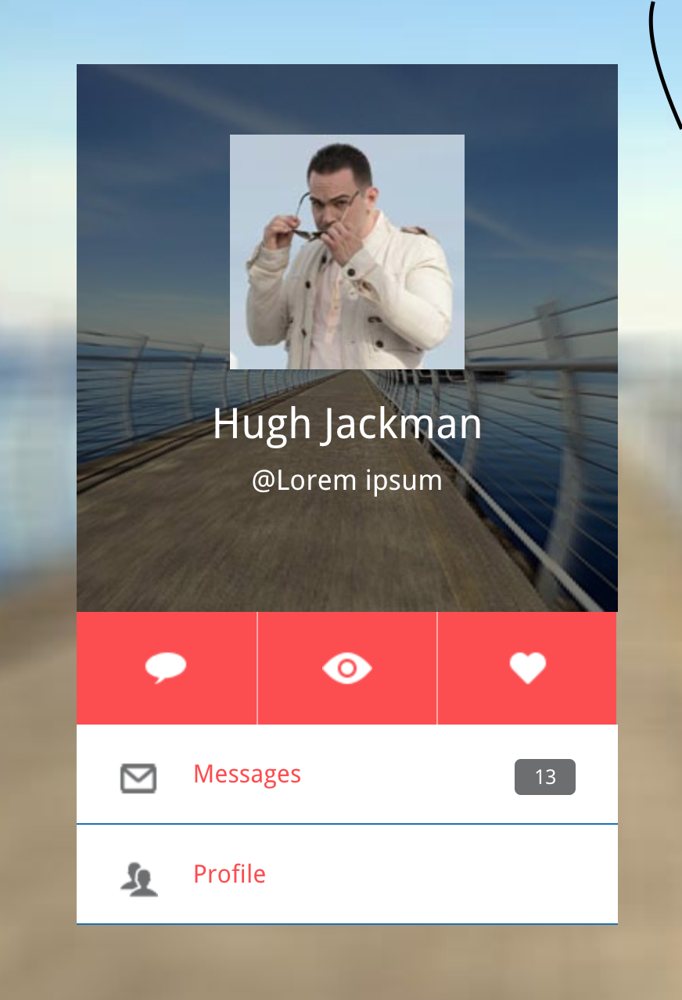
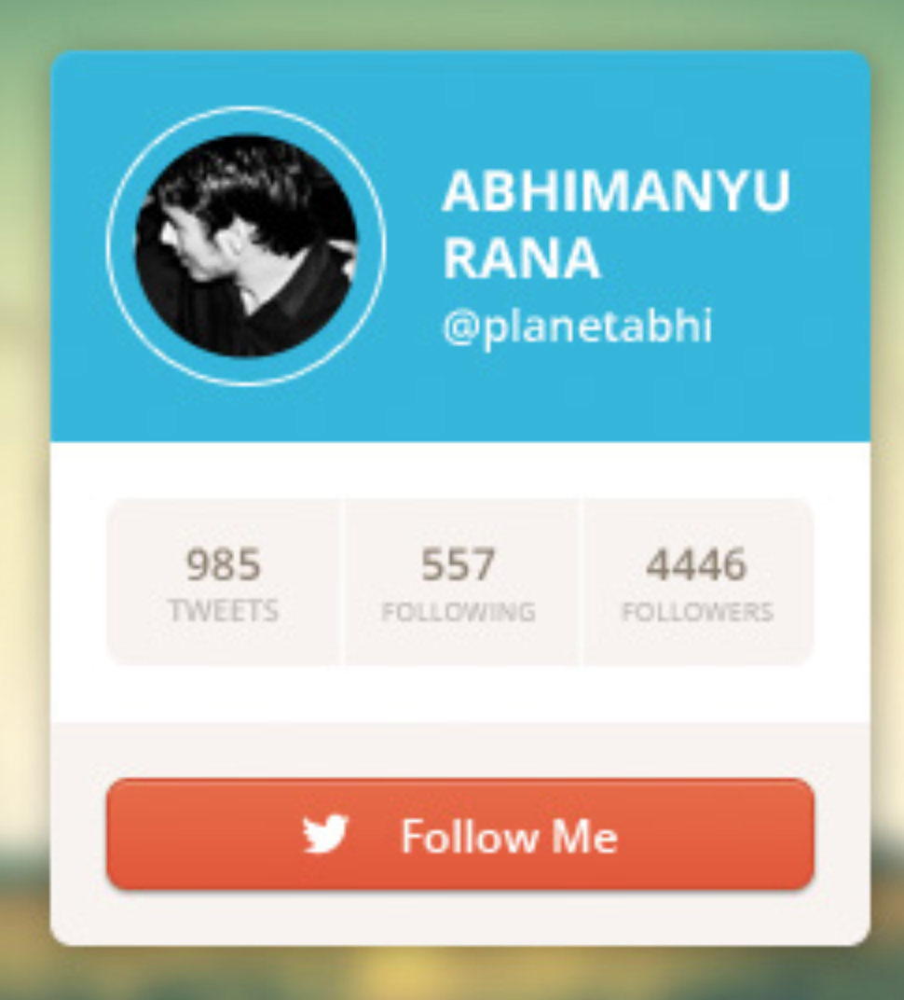

# Простейшие навыки верстки

## Задача

Сверстать карточки

## Материалы

* [Блочная модель в CSS](https://webref.ru/course/box-model)
* [Позиционирование в CSS](https://webref.ru/course/positioning)
