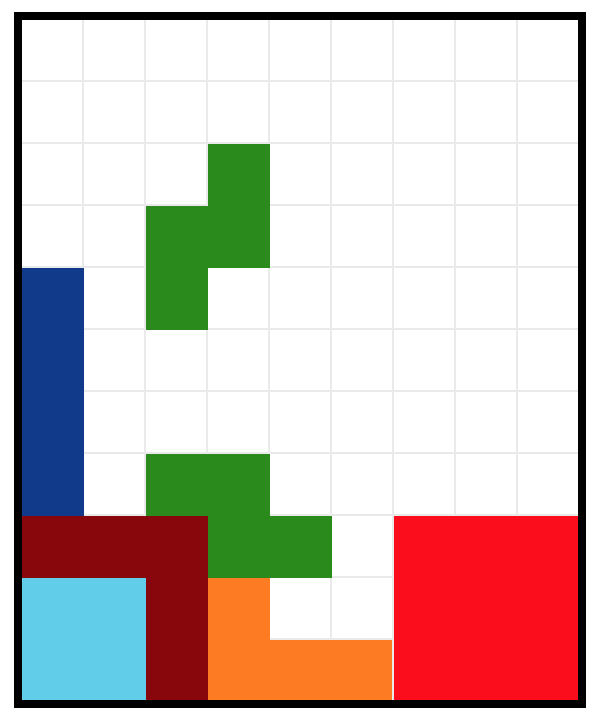

# Проверка понимания работы таблиц и табличной верстки

## Задача 1

Сверстать с помощью таблиц скриншот игры:

## Задача 2

Сверстать с помощью табличной верстки один из шаблонов для писем.
Например, отсюда
* [сумасшедшая сборка из 10-и качественных писем](http://bayguzin.ru/main/shablonyi/shablonyi-e-mail-rassyilki/email.html)
* [Beautiful emails to help inspire your next email design.
](http://htmlemaildesigns.com/)
* [email gallery](http://www.email-gallery.com/)
* [Good emails gallery](https://reallygoodemails.com/)

### Дополнительные инстументы для ознакомления
#### Фреймворки
* [MJML](https://mjml.io)

Создатели обещают, что письма, сверстанные с помощью этого фреймворка, адекватно отображаются на любом устройстве и почтовом клиенте, поддерживающем медиа-запросы.

* [Kilogram](https://github.com/dudeonthehorse/kilogram)

По словам автора, «шаблон килограмма адаптивен везде». Сам автор – Артур Кох, известный в узких кругах верстальщик.

* [Email Framework](http://emailframe.work/)

Еще один фреймворк для html-писем, который упрощает установку кнопок, изображений и ссылок.

#### Тестирование писем
* [putsmail](https://putsmail.com/)
* [mailgun](https://www.mailgun.com/)
* [litmus](https://litmus.com/)

#### Онлайн редактор
* [e-mail editor](https://topol.io)
* [stripo email](https://stripo.email/ru/)

#### Разработка на компе
* https://github.com/ireade/gulp-email-workflow
